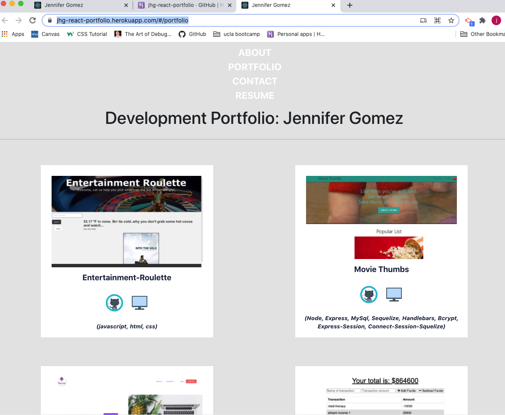

# JHG React Portfolio

https://jhg-react-portfolio.herokuapp.com/#/portfolio

## Mock Up



## Table of Contents 

- [Mock Up](#mock-up)
- [Description](#description)
- [User Story](#user-story)
- [Installation](#installation)
- [Usage](#usage)
- [Contributing](#contributing)
- [Questions](#questions)
## Description 
```
I built a react portfolio: a place to show my projects so that I can share my work with fellow developers and collaborate on future projects.

```
## User Story 
```
AS AN employer looking for candidates with experience building single-page applications
I WANT to view a potential employee's deployed React portfolio of work samples
SO THAT I can assess whether they're a good candidate for an open position
```
## Installations 
`npm init`<br />
`@testing-library/jest-dom`<br />
`@testing-library/react`<br />
`@testing-library/user-event`<br />
`bootstrap`<br />
`react`, `react-dom`, `react-router-dom`, `react-scripts`<br />
`web-vitals`
## Usage
```
Users can now view my portfolio in a React form, great for showcase and future collaborations!
```
## Contributions

[Jennifer](https://github.com/cleanjenn)

## Questions 

Feel free to contact me via email: <br /> [Email](mailto:jennifer23gomez7@gmail.com)<br /> 
[Github](https://github.com/cleanjenn)<br />